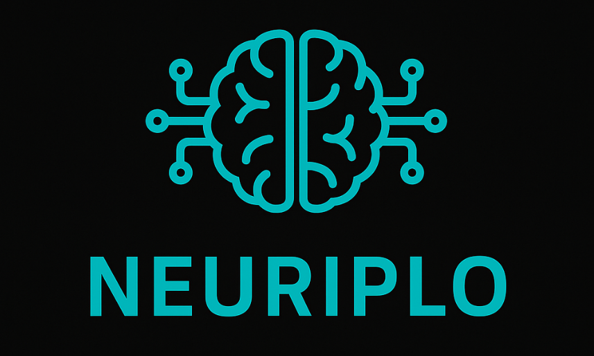

# Neuriplo



## Overview

* Neuriplo is a C++ library designed for seamless integration of various backend engines for inference tasks. 
* It supports multiple frameworks and libraries such as OpenCV DNN, TensorFlow, PyTorch (LibTorch), ONNX Runtime, TensorRT, OpenVINO and GGML.
* The project aims to provide a unified interface for performing inference using these backends, allowing flexibility in choosing the most suitable backend based on performance or compatibility requirements.
* The library is currently mainly used as component of the [Object Detection Inference Project](https://github.com/olibartfast/object-detection-inference)

## Dependencies 
- C++17
- OpenCV
- glog

### Supported Backends (Inside [versions.env](versions.env) file, versions tested in this project):
* OpenCV DNN module
* ONNX Runtime 
* Pytorch (Libtorch) 
* TensorRT 
* OpenVINO 
* Tensorflow (LibTensorFlow C++ library) - inference on saved models, not graph
* GGML - Efficient tensor library for machine learning

### Optional
* CUDA (if you want to use GPU)

## Quick Start
### Automated Setup and Testing

#### Setup Dependencies for a Specific Backend

```bash
./scripts/setup_dependencies.sh --backend <BACKEND_NAME>
```

Supported `<BACKEND_NAME>` values:

* `OPENCV_DNN`
* `ONNX_RUNTIME`
* `LIBTORCH`
* `TENSORRT`
* `LIBTENSORFLOW`
* `OPENVINO`
* `GGML`

#### Test All Backends
```bash
./scripts/test_backends.sh
````

#### Test a Specific Backend

```bash
./scripts/test_backends.sh --backend <BACKEND_NAME>
```


### Manual Build Instructions

1. Clone the repository:

   ```bash
   git clone https://github.com/inference_engines.git
   cd InferenceEngines
   ```

2. Create a build directory and navigate into it:

   ```bash
   mkdir build
   cd build
   ```

3. Configure the build with CMake:

   ```bash
   cmake ..
   ```

   Optionally, you can specify the default backend by setting `-DDEFAULT_BACKEND=your_backend` during configuration.
   - **Note**: If the backend package is not installed on your system, set the path manually in the backend's CMake module or use the automated setup scripts.

4. Build the project:

   ```bash
   cmake --build .
   ```

   This will compile the project along with the selected backend(s).

## Usage

To use the InferenceEngines library in your project, link against it and include necessary headers ([check the example here](https://github.com/olibartfast/object-detection-inference/blob/master/CMakeLists.txt)):

```cmake
target_link_libraries(your_project PRIVATE InferenceEngines)
target_include_directories(your_project PRIVATE path_to/InferenceEngines/include)
```

Ensure you have initialized and set up the selected backend(s) appropriately in your code using the provided interface headers.

## Documentation

For detailed documentation, see the [docs/](docs/) directory:

- **[Dependency Management](docs/DEPENDENCY_MANAGEMENT.md)** - Complete setup guide for all backends
